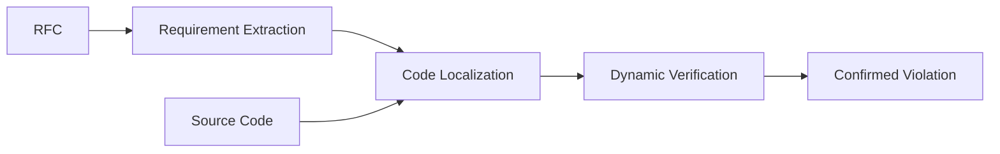

# Paper Reading Agent — Development Plan V2

> 目标：每天自动处理 5 篇科研论文，由 Agent/LLM 对 **所有论文** 生成完整、结构化、可验证的阅读结果；研究者本人负责决定其中哪 1–2 篇精读，并自行制作每篇 1 页 slide。
>
> 约束：
> - 不使用 OpenAI GPT / Anthropic Claude 原生 API。
> - 不使用本地大模型作为主力阅读模型。
> - 效果优先于最低价格，但避免无意义地把整篇 PDF 全部转成高分辨率图片。
> - 第一版优先快速可用、可调试、可替换模型，不开发通用 Agent Framework。

---

## 1. 最终技术决策

### 1.1 Agent Harness：OpenCode

OpenCode 负责：

- Agent session
- Tool calling
- 文件读写
- 自定义 Reader / Verifier agent
- 不同 provider/model 切换
- 非交互执行
- 后续 subagent / parallel session 扩展

**不从零自己实现 Agent Runtime。**

### 1.2 Orchestrator：Python

Python 只负责 deterministic workflow：

1. 扫描当天 5 篇 PDF；
2. PDF 预处理；
3. 并行启动 5 个独立 Reader session；
4. 收集 draft；
5. 启动 Verifier；
6. retry / timeout / logging；
7. 输出最终 Markdown。

设计原则：

> OpenCode 决定“Agent 如何运行”；  
> Python 决定“任务按照什么流程运行”。

---

# 2. 模型方案

## 2.1 V1 Reader：Qwen3.8-Max

用途：

- 完整论文阅读
- 长文档理解
- Method 分析
- Figure / Table 视觉理解
- Experiment 抽取
- Mermaid Method Flowchart
- 结构化 Markdown 输出

选择原因：

- 原生支持 Text + Image + Video；
- 1M context；
- 支持 reasoning；
- 支持 structured output / function calling；
- 适合长文档、图表和文档解析；
- 可通过 OpenAI-compatible API 接入 OpenCode；
- 成本明显低于 GPT / Claude 顶级 API，但不是为了最低价牺牲能力。

**V1 默认：所有 Reader 使用 Qwen3.8-Max。**

## 2.2 V1 Verifier

第一版使用：

**Qwen3.8-Max + 独立新 session**

原因：

- Verifier 必须重新获取证据，而不是沿用 Reader context；
- 减少 Reader 产生的思维锚定；
- 第一版减少 provider/API 变量；
- 多模态验证 Figure / Table 时无需额外适配。

## 2.3 V1.5 Cross-model Verifier 候选

### Kimi K3
适合：

- 长文本 second opinion；
- Method reasoning；
- Claim–Evidence consistency；
- 对 Reader draft 做独立文本审查。

注意：V1 不假设 K3 一定具有完整原生视觉能力。

### Kimi K2.6
适合：

- Figure / Table 视觉 cross-check；
- 小范围 Method 页面验证；
- 不需要整篇论文放进 context。

### DeepSeek V4 Pro
适合：

- Text-only second opinion；
- Method / Experiment reasoning；
- 后续作为低成本长文本 verifier benchmark。

## 2.4 第一版暂时不做

- GPT API
- Claude API
- 本地模型主力阅读
- 多模型动态 router
- 5 个 Reader 使用 5 个不同模型
- 为了省钱而默认用弱模型先读

第一版先把 workflow 跑稳，再做模型替换实验。

---

# 3. PDF 输入策略

不在“纯文本”和“全页图片”之间二选一。

最终采用：

# Text-first + Vision-on-demand

```text
                    paper.pdf
                        |
              +---------+---------+
              |                   |
              v                   v
       Structured Text       Page Renderer
       / Markdown                 |
              |                   |
              v                   |
          Paper Map               |
              |                   |
              +--------+----------+
                       |
                       v
                 Reader Agent
                       |
               Need visual evidence?
                 /            \
               no              yes
               |                |
               |          render/crop
               |          Figure/Table
               |                |
               +-------+--------+
                       |
                       v
                 Continue Reading
```

## 3.1 为什么不只用纯文本

会丢失：

- Method overview figure；
- 复杂表格结构；
- Figure-caption 对应关系；
- 公式；
- 多栏布局；
- 流程图中的真实组件和边。

尤其会影响自动生成 Method Flowchart。

## 3.2 为什么不把每页都转图

问题：

- visual token 浪费；
- latency 增加；
- 成本增加；
- 正文重复 OCR；
- citation 定位困难；
- context 中低价值视觉信息过多。

## 3.3 最终输入形态

默认每篇论文：

```text
完整 structured Markdown
+
3–8 个关键视觉证据
```

视觉证据包括：

- Method overview figure
- architecture / pipeline figure
- main result table
- ablation figure
- 解析失败的复杂表格
- 公式密集页

---

# 4. PDF 预处理

第一版使用 **PyMuPDF**。

必须保留：

```markdown
<!-- PAGE: 5 -->

## 3 Method

### 3.1 Requirement Extraction

正文...
```

输出：

```text
paper.md
metadata.json
pages/
figures/
```

后续只有在解析质量确实不足时再考虑：

- GROBID
- Marker
- Docling
- MinerU

V0 不同时接多套 parser。

---

# 5. 单篇论文 Workflow

```text
paper.pdf
   |
   v
PDF preprocessing
   |
   v
paper.md + metadata.json
   |
   v
+--------------------+
| Reader Agent       |
| fresh context      |
+---------+----------+
          |
          v
draft.md
evidence.json
method.json
          |
          v
+--------------------+
| Verifier Agent     |
| NEW fresh context  |
+---------+----------+
          |
          v
final.md
```

---

# 6. Reader Agent 输出要求

Reader **不判断论文值不值得精读**。

每一篇都完整输出以下六问。

## Q1. 这篇论文试图解决什么问题？

必须包含：

- Background
- Existing limitation
- Research question
- Motivation
- Claimed contributions

必须区分：

- 作者明确声称
- Reader 自己的解释

## Q2. 有哪些相关研究？

重点回答：

- 最直接 prior work
- baseline
- 本文与它们的区别

推荐表格：

| Work / Category | Problem | Method | Difference |
|---|---|---|---|

避免机械罗列 Related Work 全部 citation。

---

# 7. Q3 Method — 核心模块

Method 必须生成五部分。

## 7.1 Method Overview

用 1–3 段说明：

- Input 是什么
- Output 是什么
- 核心 insight
- 为什么采用这个 pipeline

## 7.2 Structured Method Graph

先生成 `method.json`：

```json
{
  "inputs": ["RFC specification", "source code"],
  "nodes": [
    {
      "id": "S1",
      "name": "Requirement Extraction",
      "input": ["RFC specification"],
      "operation": "Extract normative requirements",
      "output": ["requirements"],
      "tool": "LLM",
      "evidence": {
        "section": "3.1",
        "pages": [5]
      }
    },
    {
      "id": "S2",
      "name": "Code Localization",
      "input": ["requirements", "source code"],
      "output": ["relevant code"],
      "evidence": {
        "section": "3.2",
        "pages": [6]
      }
    }
  ],
  "edges": [
    {
      "from": "S1",
      "to": "S2",
      "evidence": "Figure 2, p.5"
    }
  ]
}
```

## 7.3 Mermaid Flowchart

**由 `method.json` 生成，而不是让模型直接凭印象画图。**



要求：

- 每个 major node 有证据；
- 每条 edge 有正文或 Figure 支撑；
- 禁止为了画图完整而补不存在的步骤；
- 不确定的边不能当 confirmed edge。

## 7.4 Step-by-step Explanation

| Step | Input | Operation | Tool / Model | Output | Why Needed | Evidence |
|---|---|---|---|---|---|---|

重点解释：

- 组件依赖；
- LLM 在哪里；
- Program Analysis 在哪里；
- Dynamic Testing / Fuzzing 在哪里；
- Retrieval / Solver / Tool 在哪里；
- 为什么需要该步骤。

## 7.5 Key Implementation Details

记录：

- model
- prompt / agent setup
- static analysis framework
- fuzzer
- solver
- retrieval
- environment
- important hyperparameters

没有报告时明确写：

> Not reported

禁止推测。

---

# 8. Q4 Experiment

必须抽取：

- Dataset
- Number of projects / samples
- Baselines
- Models
- Metrics
- Agent / harness
- Experimental constraints
- Hardware / runtime（论文提供时）
- Trial count
- Network access（相关时）

按论文原始 RQ 组织：

```text
RQ1
RQ2
RQ3
...
```

Main Results：

| RQ | Dataset | Baseline | Metric | Result | Evidence |
|---|---|---|---|---|---|

重要数字必须记录：

- Table
- Figure
- Page

---

# 9. Q5 可以进一步探索什么？

拆成两部分。

## 9.1 Authors' Limitations / Future Work

只记录作者明确提出的：

- limitation
- threat to validity
- future work

## 9.2 Reader Analysis

允许 LLM 提出：

- potential gap
- missing baseline
- missing ablation
- evaluation weakness
- generalization problem
- reproducibility issue
- possible follow-up experiment

必须标记：

```text
[LLM Analysis]
```

不能冒充作者观点。

---

# 10. Q6 Summary

生成两个版本。

### Short Summary

200–300 字，用于日常快速复习。

### Full Summary

完整解释：

- problem
- method
- result
- contribution
- limitation

---

# 11. Evidence Index

每篇 final.md 最后必须有：

```markdown
## Evidence Index

| Claim | Evidence |
|---|---|
| System has three stages | §3, Figure 2, p.5 |
| Evaluated on 20 projects | §4.1, p.9 |
| Improves recall by X% | Table 3, p.11 |
```

原则：

> Summary 必须可追溯，而不是“看起来合理”。

---

# 12. Verifier Agent

Verifier 必须使用新的独立 context。

输入：

- `paper.md`
- 必要 page images
- `draft.md`
- `method.json`
- `evidence.json`

不读取 Reader conversation history。

## Verification Checklist

### Facts

检查：

- dataset
- sample size
- baseline
- model
- metrics
- main numbers

### Method

检查：

- major component 是否遗漏
- step 顺序
- input/output
- tool attribution

### Mermaid

逐项验证：

- node 是否存在
- edge 是否存在
- direction 是否正确
- 是否凭空增加 feedback loop
- 是否把 experiment workflow 当成 Method
- 是否把 Related Work 方法混进本文

### Claim

区分：

```text
Author Claim
Reader Inference
LLM Analysis
```

### Experiment

核对：

- table number
- figure number
- numeric result
- denominator
- percentage
- unit
- dataset size

---

# 13. 每天 5 篇并行方式

采用 paper-level parallelism：

```text
                    Orchestrator
                         |
       +---------+-------+-------+---------+
       |         |       |       |         |
       v         v       v       v         v
     Paper1    Paper2  Paper3  Paper4    Paper5
     Reader    Reader  Reader  Reader    Reader
```

初始配置：

```yaml
reader_concurrency: 3
verifier_concurrency: 2
max_retries: 2
```

不要第一天就并发 10 个大请求。

---

# 14. 项目目录

```text
paper-reading-agent/
│
├── inbox/
│   └── YYYY-MM-DD/
│       ├── paper-01.pdf
│       └── ...
│
├── workspace/
│   └── <paper-id>/
│       ├── original.pdf
│       ├── paper.md
│       ├── metadata.json
│       ├── pages/
│       ├── figures/
│       ├── draft.md
│       ├── method.json
│       ├── evidence.json
│       └── logs/
│
├── output/
│   └── YYYY-MM-DD/
│       ├── paper-01.md
│       └── ...
│
├── agents/
│   ├── paper-reader.md
│   └── paper-verifier.md
│
├── prompts/
│   ├── reader-system.md
│   ├── verifier-system.md
│   └── schemas/
│       ├── paper-report.schema.json
│       └── method.schema.json
│
├── tools/
│   ├── pdf_extract.py
│   ├── pdf_render.py
│   ├── crop_figure.py
│   └── validate_mermaid.py
│
├── config/
│   └── config.yaml
│
├── src/
│   ├── orchestrator.py
│   ├── opencode_worker.py
│   ├── jobs.py
│   ├── models.py
│   └── logging.py
│
└── tests/
```

---

# 15. V1 配置

```yaml
models:
  reader:
    provider: alibaba
    model: qwen3.8-max
    thinking: true

  verifier:
    provider: alibaba
    model: qwen3.8-max
    thinking: true
    isolated_context: true

  cross_verifier:
    enabled: false
    provider: moonshot
    model: kimi-k3

pdf:
  extraction: pymupdf
  keep_page_markers: true
  default_dpi: 160
  max_visual_pages: 8

workflow:
  reader_concurrency: 3
  verifier_concurrency: 2
  max_retries: 2

output:
  language: zh-CN
  format: markdown
  include_mermaid: true
  include_evidence_index: true
```

---

# 16. Job 状态机

每篇论文独立运行：

```text
PENDING
  ↓
PREPROCESSING
  ↓
READING
  ↓
VERIFYING
  ↓
DONE
```

失败状态：

```text
PREPROCESS_FAILED
READER_FAILED
VERIFY_FAILED
```

Paper 3 失败时只 retry Paper 3。

---

# 17. Logging

至少记录：

```json
{
  "paper": "paper-01",
  "reader_model": "qwen3.8-max",
  "reader_input_tokens": 0,
  "reader_output_tokens": 0,
  "visual_pages": [4, 8, 11],
  "reader_latency": 0,
  "verify_latency": 0,
  "retry_count": 0,
  "status": "done"
}
```

后续用来评估：

- cost
- latency
- context size
- visual page count
- failure rate

---

# 18. Calibration Set

正式日用前选 10–20 篇你已经精读过的论文。

建议包含：

- ProtocolGuard
- RFCAudit
- CyberGym
- CyberGym-e2e
- SWE-bench
- ExploitBench
- CodaMOSA
- 其他熟悉的 LLM + Testing / SVD paper

这些论文你已有正确认知，因此可以作为 ground truth。

---

# 19. Calibration Metrics

| Metric | Score |
|---|---:|
| Problem correctness | 0–5 |
| Contribution correctness | 0–5 |
| Method component recall | 0–5 |
| Method edge correctness | 0–5 |
| Experiment completeness | 0–5 |
| Numeric accuracy | 0–5 |
| Figure understanding | 0–5 |
| Hallucination control | 0–5 |
| Evidence quality | 0–5 |
| Overall usefulness | 0–5 |

特别关注：

## Method Component Recall

论文真实关键组件中，Agent 找到了多少。

## Method Edge Precision

```text
正确 edge / Agent 生成的全部 edge
```

直接评价 Mermaid 的可靠性。

---

# 20. 模型 A/B Test

第一轮只比较三组：

### A — Qwen3.8-Max

```text
Text-first + selective vision
```

### B — Kimi

```text
K3 做 text verifier
K2.6 做需要视觉的 cross-check
```

### C — DeepSeek V4 Pro

```text
Text-first verifier
```

判断标准不是公开 benchmark 总分，而是：

> 在你的 Paper Reading Schema 下，谁犯错最少、信息最完整。

---

# 21. Context Policy A/B Test

单独用少量论文比较：

### Policy A — Text Only

```text
structured Markdown
```

### Policy B — Image Only

```text
PDF pages → images
```

只作为实验，不作为日常主方案。

### Policy C — Hybrid

```text
full structured text
+
selected visual evidence
```

预期主方案：

**Policy C**

评价：

- Method accuracy
- Table accuracy
- Mermaid accuracy
- token usage
- latency

---

# 22. Development Phases

## Phase 0 — Minimal Prototype

目标：

> 1 篇论文 → 1 份合格 Markdown

实现：

- [ ] OpenCode 安装与 provider 配置
- [ ] Qwen3.8-Max 接入
- [ ] PyMuPDF extraction
- [ ] page markers
- [ ] Reader prompt
- [ ] Q1–Q6
- [ ] Method Mermaid
- [ ] output markdown

推荐测试：

**ProtocolGuard**

DoD：

> 生成结果已经可以替代你对普通论文的第一轮机械阅读。

---

## Phase 1 — Evidence-grounded Reader

实现：

- [ ] evidence index
- [ ] section/page references
- [ ] numeric extraction
- [ ] method.json
- [ ] Mermaid from method.json
- [ ] selective page rendering
- [ ] Figure/Table visual input

DoD：

> Method 和 Experiment 主要事实都能回到论文找到证据。

---

## Phase 2 — Verifier

实现：

- [ ] independent verifier context
- [ ] factual verification
- [ ] numeric verification
- [ ] Method verification
- [ ] Mermaid node verification
- [ ] Mermaid edge verification
- [ ] final.md

DoD：

> Verifier 会实际发现 Reader 错误，而不是机械复述 Reader。

---

## Phase 3 — Five-paper Batch

实现：

```text
5 PDFs
 ↓
parallel readers
 ↓
parallel verifiers
 ↓
5 final.md
```

增加：

- concurrency
- timeout
- retry
- logging
- resume
- per-paper state

命令：

```bash
python -m src.orchestrator inbox/2026-09-15
```

DoD：

> 一个命令稳定处理 5 篇论文。

---

## Phase 4 — Calibration

运行 10–20 篇已知论文。

比较：

- Qwen3.8-Max
- Kimi
- DeepSeek

同时比较：

- text-only
- hybrid

此阶段完成之后才真正冻结模型。

---

## Phase 5 — Daily Workflow

每天：

```text
1. 放入 5 个 PDF
2. 执行 paper-read
3. 自动 Reader + Verifier
4. 得到 5 个 final.md
5. 你阅读 5 份结果
6. 你自己决定 1–2 篇精读
7. 精读时用 LLM 交互辅助
8. 你自己做 5 页 slide
```

Agent 永远不替你决定哪篇值得精读。

---

# 23. V1 明确不做

为了避免 scope creep：

- Zotero 双向同步
- 自动推荐论文
- 自动决定精读 paper
- 自动生成 PPT
- GraphRAG
- Vector DB
- long-term memory
- knowledge graph
- autonomous web research
- complex multi-agent debate
- dynamic model routing
- LangGraph
- AutoGen
- CrewAI
- 自己实现通用 Agent Framework

这些都不是当前 bottleneck。

---

# 24. 开发顺序

严格按：

```text
1. 单篇 PDF → structured Markdown
        ↓
2. Q1–Q6 Reader
        ↓
3. Method structured graph
        ↓
4. Mermaid
        ↓
5. selective vision
        ↓
6. evidence index
        ↓
7. Verifier
        ↓
8. 5-paper parallel
        ↓
9. logging / retry
        ↓
10. calibration
```

不要先做复杂 multi-agent。

---

# 25. 最终架构

```text
                     Daily 5 PDFs
                          |
                          v
                Python Orchestrator
                          |
             +------------+------------+
             |                         |
             v                         v
        PDF Processor              Job Manager
             |                         |
      structured text                  |
      + page render                    |
             |                         |
             +------------+------------+
                          |
             5 independent OpenCode
                   Reader Sessions
                          |
                  Qwen3.8-Max
                          |
              +-----------+-----------+
              |           |           |
           draft.md   method.json  evidence.json
              |
              v
          Verifier
       fresh context
              |
              v
           final.md
              |
              v
             Human
              |
       +------+------+
       |             |
   3–4 粗读       1–2 精读
                         |
                  interactive LLM
                         |
                         v
                    Human Slides
```

---

# 26. 当前冻结的 V1 技术栈

```yaml
harness: opencode
orchestrator: python

reader:
  model: qwen3.8-max

verifier:
  model: qwen3.8-max
  isolated_context: true

cross_model_candidates:
  - kimi-k3
  - kimi-k2.6
  - deepseek-v4-pro

pdf:
  parser: pymupdf
  policy: text-first-selective-vision

output:
  format: markdown
  language: chinese
  method_graph: json
  method_visualization: mermaid

human:
  choose_deep_read: true
  deep_read_1_to_2_papers: true
  make_slides: true
```

---

# 27. 核心原则

1. **Agent 负责读，不负责替你决定读什么。**
2. **Text 负责读，Vision 负责看。**
3. **Summary 必须 evidence-grounded。**
4. **Workflow 是你的，Agent Runtime 不需要是你的。**
5. **模型选择最终由你的 calibration set 决定，不由公开 benchmark 代替。**

这就是 V1 的冻结版本。后续修改应由真实运行结果、错误类型和 calibration 数据驱动，而不是继续反复切换框架。
